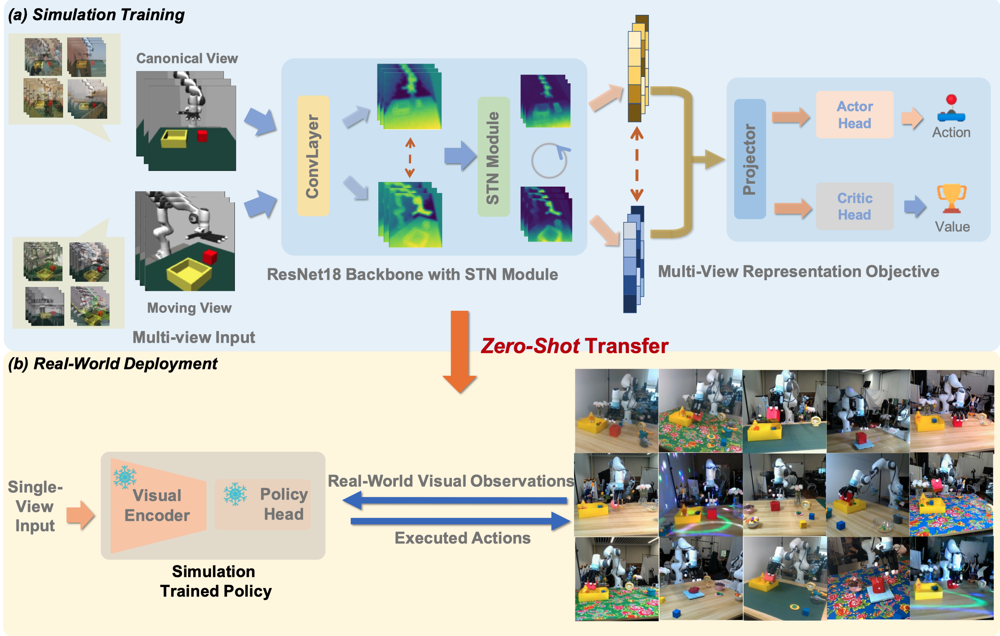

# Maniwhere

<a href="https://gemcollector.github.io/maniwhere/"><strong>Project Page</strong></a>
  |
  <a href="https://arxiv.org/abs/2407.15815"><strong>arXiv</strong></a>
  |

  <a href="https://gemcollector.github.io/">Zhecheng Yuan*</a>, 
  <a href="https://www.stillwtm.site/">Tianming Wei*</a>, 
  <a href="">Shuiqi Cheng</a>, 
  <a href="https://www.gu-zhang.com/">Gu Zhang</a>, 
  <a href="https://cypypccpy.github.io/">Yuanpei Chen</a>, 
  <a href="http://hxu.rocks/">Huazhe Xu</a>

  *The first two authors contribute equally. 

<div align="center">
  
</div>


# 💻 Installation

```
conda env create -f environment.yml 
```

  # 🛠️ Usage
The algorithms will use the [Places](http://places2.csail.mit.edu/download.html) dataset for data augmentation, which can be downloaded by running
```
wget http://data.csail.mit.edu/places/places365/places365standard_easyformat.tar
```
After downloading and extracting the data, add your dataset directory to the datasets list in `cfgs/aug_config.cfg`.

For training:

```
bash scripts/train.sh
```

For evaluation:
```
bash scripts/eval.sh ours
```
You should modify the  `model_path` in `mani_eval.py` first. You would better to check the saved video. The recorded success rate might miss some successful trials. 


# 📝 Citation

If you find our work useful, please consider citing:
```
@article{yuan2024learning,
  title={Learning to Manipulate Anywhere: A Visual Generalizable Framework For Reinforcement Learning},
  author={Yuan, Zhecheng and Wei, Tianming and Cheng, Shuiqi and Zhang, Gu and Chen, Yuanpei and Xu, Huazhe},
  journal={arXiv preprint arXiv:2407.15815},
  year={2024}
}
```
# 🙏 Acknowledgement
Our code is generally built upon [DrQ-v2](https://github.com/facebookresearch/drqv2). The robot model built upon [mujoco-menagerie](https://github.com/google-deepmind/mujoco_menagerie) . The website is borrowed from  [DP3](). We thank all these authors for their nicely open sourced code and their great contributions to the community.

# 🏷️ License
This repository is released under the MIT license. 